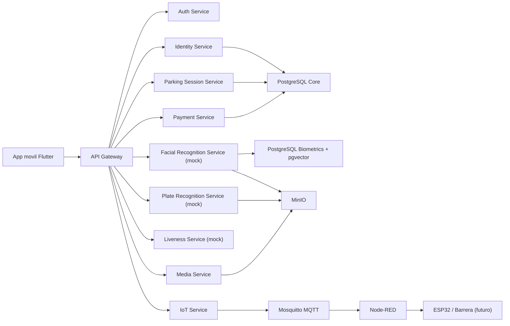

# Diagrama de Contexto

## Nota

En esta fase el gateway existe como servicio base con catalogo y salud. La orquestacion real entre servicios se implementara despues, cuando empecemos los flujos de entrada y salida end-to-end.
