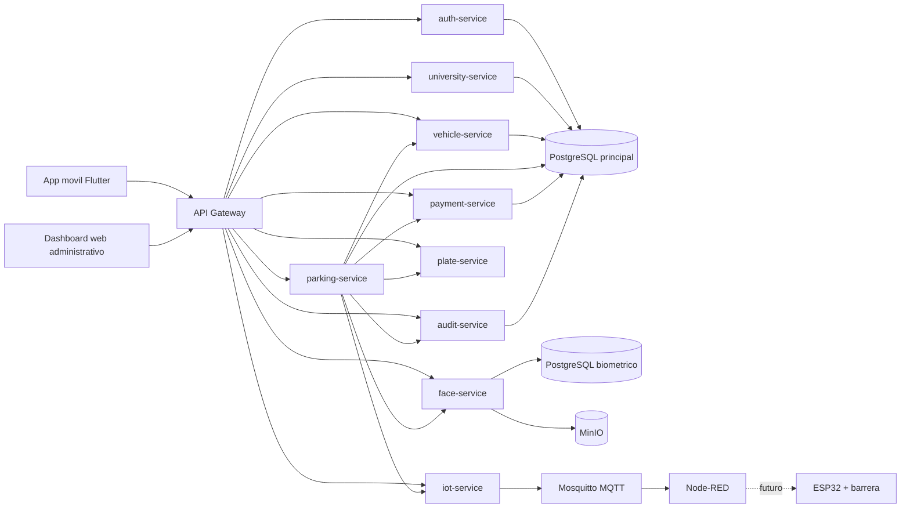
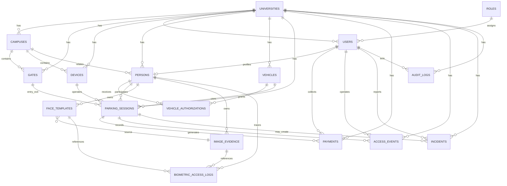

# Smart Parking University - Documentacion Final del Proyecto

## 1. Resumen ejecutivo

Smart Parking University es una plataforma mobile-first orientada a la gestion inteligente del acceso vehicular en entornos universitarios. El sistema fue concebido para operar en multiples universidades, campus y puertas, integrando validacion de placa, validacion facial, anti-spoofing, control de sesiones de parqueo, gestion de pagos y apertura de barreras mediante una capa IoT. La solucion adopta una arquitectura basada en microservicios con FastAPI, una aplicacion movil en Flutter, almacenamiento transaccional en PostgreSQL, una base biometrica separada, almacenamiento de evidencia en MinIO y comunicacion IoT sobre MQTT.

El proyecto se desarrollo por fases, privilegiando una estrategia incremental. En la etapa actual se dispone de una base funcional con servicios mock, flujos operativos de entrada y salida, seguridad con JWT y RBAC, una maqueta IoT en Node-RED y un dashboard web administrativo para consulta por roles. Esta aproximacion permite validar arquitectura, experiencia operativa y contratos de integracion antes de incorporar modelos reales de reconocimiento facial y lectura automatica de placas.

## 2. Objetivo general

Disenar e implementar una plataforma distribuida para el control inteligente de parqueaderos universitarios que permita gestionar accesos vehiculares de visitantes, estudiantes, docentes y trabajadores, garantizando trazabilidad, seguridad, control de pagos y preparacion para integracion biometrica e IoT.

## 3. Objetivos especificos

- Modelar un dominio multiuniversidad capaz de administrar universidades, campus, puertas, dispositivos, personas, vehiculos y sesiones de parqueo.
- Implementar una arquitectura de microservicios desacoplada y extensible para autenticacion, parqueo, pagos, auditoria, biometria, placas e IoT.
- Desarrollar una aplicacion movil que permita operar entradas y salidas desde dispositivos Android o iOS.
- Disenar una base de datos principal y una base biometrica separada para reducir exposicion de informacion sensible.
- Integrar un mecanismo inicial de liveness detection para disminuir el riesgo de suplantacion mediante fotos o videos.
- Preparar una capa IoT basada en MQTT para apertura de barreras, telemetria y futura conexion con ESP32.
- Incorporar controles de seguridad como JWT, RBAC, auditoria, rate limiting y minimizacion de datos por rol.
- Documentar el sistema con enfoque academico y tecnico para fines de exposicion universitaria, evolucion y mantenimiento.

## 4. Alcance

El alcance de la solucion cubre la administracion de accesos vehiculares en universidades con multiples sedes y puertas, incluyendo captura de evidencia desde la aplicacion movil, validacion operativa para visitantes y personal institucional, creacion y cierre de sesiones de parqueo, calculo y registro de pagos, generacion de incidentes, auditoria de eventos, integracion IoT simulada y consulta administrativa por web.

En la fase actual no se incluye todavia la ejecucion productiva de modelos pesados de OCR o reconocimiento facial real, ni la conexion fisica definitiva con actuadores de barrera. En su lugar, el sistema deja definidos los contratos, los microservicios y las interfaces de sustitucion para evolucionar progresivamente hacia motores reales.

## 5. Problema que resuelve

En numerosos campus universitarios, el control de parqueaderos se realiza mediante procedimientos manuales, validaciones visuales poco confiables o sistemas aislados sin trazabilidad centralizada. Esto genera riesgos de acceso no autorizado, suplantacion de identidad, uso indebido de vehiculos autorizados, demoras operativas, errores en el cobro a visitantes y dificultad para auditar incidentes.

La propuesta resuelve este problema mediante una plataforma que centraliza la validacion de identidad y vehiculo, controla sesiones de parqueo entre puertas distintas, separa responsabilidades por rol, registra evidencia auditable y prepara la automatizacion del acceso fisico con IoT. De esta forma, se mejora la seguridad, se reducen tiempos de operacion y se fortalece la trazabilidad institucional.

## 6. Arquitectura del sistema

La arquitectura se organiza en cinco capas principales:

1. Capa cliente movil: aplicacion Flutter para operacion en puerta, captura de rostro y placa, ejecucion del reto de liveness y consumo de endpoints del backend.
2. Capa cliente web: dashboard administrativo para consulta operativa, pagos pendientes, incidentes y auditoria segun rol.
3. Capa de microservicios: servicios especializados para autenticacion, universidades, vehiculos, sesiones, pagos, auditoria, reconocimiento facial, deteccion de placas e IoT.
4. Capa de datos: PostgreSQL principal para el dominio transaccional, PostgreSQL biometrico para plantillas y evidencia sensible, y MinIO para objetos asociados a imagenes.
5. Capa IoT: Mosquitto como broker MQTT, Node-RED como maqueta funcional y una futura integracion con ESP32 para accionamiento fisico.

El sistema sigue principios de separacion de responsabilidades, menor privilegio, preparacion para escalabilidad horizontal y desacoplamiento entre componentes de negocio, biometria y control fisico.

## 7. Diagrama de microservicios

## 8. Diagrama de base de datos

La base transaccional concentra entidades de negocio y operacion, mientras que la base biometrica concentra `face_templates`, `image_evidence` y `biometric_access_logs`. Esta separacion reduce superficie de exposicion y permite aplicar politicas especificas sobre datos sensibles.

## 9. Flujo de entrada

El flujo de entrada inicia cuando el operador selecciona universidad, campus y puerta desde la aplicacion movil. Posteriormente, el sistema captura o simula la lectura de la placa y la captura facial del conductor. Antes de enviar la operacion, la aplicacion ejecuta un reto de liveness que solicita acciones como mirar a la izquierda, mirar a la derecha o parpadear. Si el `liveness_score` es inferior al umbral configurado, el proceso se bloquea en el dispositivo.

Cuando el score es valido, la aplicacion envia la solicitud a `POST /parking/entry`. Si la persona es visitante, `parking-service` crea una sesion temporal con estado `INSIDE` y `payment_status` `PENDING`. Si se trata de un estudiante, docente o trabajador, se valida que la placa exista, que el rostro corresponda a una persona autorizada para ese vehiculo y que el permiso se encuentre vigente. En caso de aprobacion, se registra el evento de acceso, se genera auditoria y `iot-service` publica la orden de apertura de barrera.

## 10. Flujo de salida

En la salida, la aplicacion vuelve a capturar placa y rostro y ejecuta nuevamente el reto de liveness. Para visitantes, el backend localiza la sesion activa asociada a la placa, compara el rostro actual con la referencia de entrada mediante `face-service`, valida que el pago haya sido realizado y autoriza la salida solo si todas las verificaciones resultan satisfactorias.

Para estudiantes, docentes y trabajadores, el sistema valida que la placa pertenezca al dominio institucional, que el rostro corresponda a una persona autorizada para ese vehiculo y que el permiso siga vigente. Cuando la validacion falla, se registra un incidente y no se ordena la apertura de la barrera. Cuando es exitosa, se actualiza la sesion, se registra el evento y se publica el comando MQTT de apertura.

## 11. Roles del sistema

El sistema adopta un esquema RBAC con los siguientes roles:

- `superadmin`: administra toda la plataforma y todas las universidades.
- `admin_university`: administra configuraciones y operacion de una universidad especifica.
- `security`: supervisa accesos, incidentes y validaciones operativas.
- `cashier`: consulta sesiones y registra pagos de visitantes.
- `gate_operator`: opera entradas y salidas desde dispositivos de puerta.
- `auditor`: consulta trazas, bitacoras y evidencias de auditoria.
- `student`, `teacher`, `employee` y `visitor`: representan actores del dominio, pero no poseen privilegios administrativos internos en la fase actual.

La interfaz web administrativa tambien respeta minimizacion por rol. Por ejemplo, el perfil `cashier` solo visualiza placa, tiempo, monto y estado de pago; `security` puede consultar incidentes; y `auditor` se restringe a la bitacora de auditoria.

## 12. Seguridad y proteccion de datos

La seguridad del sistema se fundamenta en autenticacion por JWT, control de acceso por roles y permisos, auditoria transversal, rate limiting basico y separacion de datos sensibles. Cada microservicio valida firma, emisor, audiencia y expiracion del token antes de atender operaciones protegidas. Asimismo, los payloads se validan mediante esquemas tipados y se evita exponer informacion sensible en respuestas no necesarias.

La proteccion de datos biometricos se aborda mediante una base separada del dominio principal, referencias a objetos almacenados en MinIO en lugar de fotos embebidas dentro de PostgreSQL, uso de hashes SHA-256 para integridad y campos de expiracion para politicas de retencion. A nivel conceptual, la plataforma queda preparada para cifrado en transito, cifrado en reposo y administracion externa de secretos por variables de entorno.

## 13. IoT y maqueta

La capa IoT se apoya en Mosquitto como broker MQTT y Node-RED como entorno de integracion y visualizacion. Una vez que `parking-service` valida una entrada o salida, solicita a `iot-service` la publicacion de un comando de apertura en topicos organizados por universidad, campus y puerta. Node-RED consume dichos mensajes, los representa en una vista HTTP y responde con un estado simulado de barrera.

Los topicos implementados siguen la estructura:

- `universities/{university_id}/campuses/{campus_id}/gates/{gate_id}/cmd`
- `universities/{university_id}/campuses/{campus_id}/gates/{gate_id}/status`

Esta maqueta permite validar mensajeria, trazabilidad y futura interoperabilidad con un ESP32 encargado de mover un servomotor o rele de barrera.

## 14. Tecnologias utilizadas

- `FastAPI`: implementacion de microservicios backend.
- `Flutter`: aplicacion movil para operacion en puerta.
- `HTML`, `CSS` y `JavaScript`: dashboard web administrativo simple.
- `PostgreSQL`: persistencia transaccional principal.
- `pgvector`: preparacion de embeddings faciales.
- `MinIO`: almacenamiento de imagenes y evidencia operativa.
- `Mosquitto MQTT`: broker de mensajeria IoT.
- `Node-RED`: maqueta visual y orquestacion de flujos IoT.
- `ThingsBoard`: previsto para observabilidad IoT futura.
- `Docker Compose`: orquestacion del entorno local de desarrollo.
- `JWT`: autenticacion y autorizacion distribuida.
- `Python unittest` y `FastAPI TestClient`: base para pruebas de servicios.

## 15. Casos de uso

Los principales casos de uso identificados son los siguientes:

1. Registrar ingreso de visitante con captura de placa, rostro y liveness.
2. Registrar salida de visitante validando coincidencia de placa, coincidencia facial y pago efectuado.
3. Autorizar entrada o salida de estudiante, docente o trabajador con placa previamente autorizada.
4. Consultar una sesion de cobro por placa o por codigo QR desde caja.
5. Registrar el pago de una sesion de parqueo y actualizar su estado.
6. Registrar y consultar incidentes de acceso, pago, liveness o conectividad.
7. Consultar bitacoras de auditoria para fines de control interno.
8. Publicar ordenes IoT de apertura de barrera y recibir estado simulado de dispositivos.
9. Gestionar universidades, campus, puertas, personas y vehiculos desde la capa administrativa.

## 16. Pruebas realizadas

Durante las fases de implementacion se construyeron pruebas automatizadas para componentes criticos del sistema, entre ellas:

- [backend/services/parking-service/tests/test_entry_flow.py](C:\Users\damia\OneDrive\Documentos\parqueadero\backend\services\parking-service\tests\test_entry_flow.py)
- [backend/services/parking-service/tests/test_exit_flow.py](C:\Users\damia\OneDrive\Documentos\parqueadero\backend\services\parking-service\tests\test_exit_flow.py)
- [backend/services/payment-service/tests/test_payment_flow.py](C:\Users\damia\OneDrive\Documentos\parqueadero\backend\services\payment-service\tests\test_payment_flow.py)
- [backend/services/plate-service/tests/test_plate_detection.py](C:\Users\damia\OneDrive\Documentos\parqueadero\backend\services\plate-service\tests\test_plate_detection.py)
- [backend/services/face-service/tests/test_face_service.py](C:\Users\damia\OneDrive\Documentos\parqueadero\backend\services\face-service\tests\test_face_service.py)
- [backend/services/iot-service/tests/test_iot_routes.py](C:\Users\damia\OneDrive\Documentos\parqueadero\backend\services\iot-service\tests\test_iot_routes.py)

Adicionalmente, en la revision actual se ejecutaron verificaciones de consistencia tecnica:

- Validacion sintactica del dashboard web mediante `node --check web\admin-dashboard\app.js`.
- Compilacion de los modulos Python mediante `python -m compileall backend\services`.

Tambien se intento ejecutar una prueba unitaria del flujo de pagos en el entorno local actual. Sin embargo, la ejecucion fallo por ausencia de la dependencia `fastapi` en el interprete local, lo que indica que la corrida integral de pruebas backend debe realizarse dentro de un entorno con dependencias instaladas o mediante contenedores Docker.

## 17. Limitaciones

La principal limitacion actual es que los servicios de reconocimiento facial, deteccion de placas y liveness operan en modo mock o con estructura preparada para integraciones reales, pero sin un modelo productivo definitivo. Esto implica que la plataforma valida flujos, contratos y arquitectura, aunque no representa todavia la precision real de un despliegue con IA.

Asimismo, la maqueta IoT aun no controla una barrera fisica real, el dashboard web trabaja con datos simulados, la persistencia de ciertos microservicios no se encuentra completamente integrada de extremo a extremo y algunas pruebas automatizadas requieren un entorno Python con dependencias instaladas. Estas limitaciones son coherentes con el enfoque incremental adoptado por el proyecto.

## 18. Trabajo futuro

Como trabajo futuro se propone:

- Integrar un modelo real de deteccion de placas basado en YOLO y OCR.
- Integrar un motor de reconocimiento facial real, por ejemplo InsightFace, DeepFace o CompreFace.
- Sustituir el proveedor mock de liveness por un runtime real con TensorFlow Lite, MediaPipe o ML Kit.
- Conectar `iot-service` con un ESP32 y actuadores fisicos para apertura y cierre de barreras.
- Consolidar persistencia real y consultas administrativas en el dashboard web.
- Incorporar monitoreo avanzado, observabilidad y alertas con ThingsBoard u otra plataforma.
- Fortalecer pruebas end-to-end sobre Docker Compose y pruebas de carga.
- Implementar sincronizacion offline, reintentos y resiliencia adicional en la aplicacion movil.

## 19. Conclusiones

El proyecto Smart Parking University demuestra la viabilidad de una solucion distribuida para el control de parqueaderos universitarios con enfoque mobile-first, segmentacion por roles y preparacion para biometria e IoT. La estrategia de implementacion por fases permitio establecer primero la arquitectura base, los contratos de servicio, la seguridad y los flujos operativos antes de introducir componentes de inteligencia artificial o hardware fisico de mayor complejidad.

Desde una perspectiva academica y de ingenieria, el sistema ofrece un caso solido de integracion entre desarrollo backend, modelado de datos, seguridad aplicada, experiencia de usuario movil y mensajeria IoT. La separacion de datos biometricos, la adopcion de microservicios y el enfoque de minimizacion de datos constituyen decisiones de diseno relevantes para escenarios reales de seguridad institucional.

## 20. Recomendaciones

Se recomienda que la siguiente etapa del proyecto se concentre en cerrar el ciclo entre prototipo y despliegue controlado. Para ello, conviene priorizar la instalacion reproducible de dependencias, la ejecucion sistematica de pruebas en contenedores, la sustitucion de mocks por motores reales de IA y la integracion de hardware sobre un entorno piloto de una sola universidad o campus.

Tambien se recomienda formalizar politicas de retencion de evidencia, cifrado de objetos en MinIO, rotacion de secretos, monitoreo centralizado y trazabilidad de apertura de barreras. Desde la perspectiva academica, resulta conveniente complementar esta documentacion con resultados experimentales futuros sobre precision de reconocimiento, tiempos de respuesta, disponibilidad operativa y aceptacion por parte de usuarios de puerta y personal administrativo.
